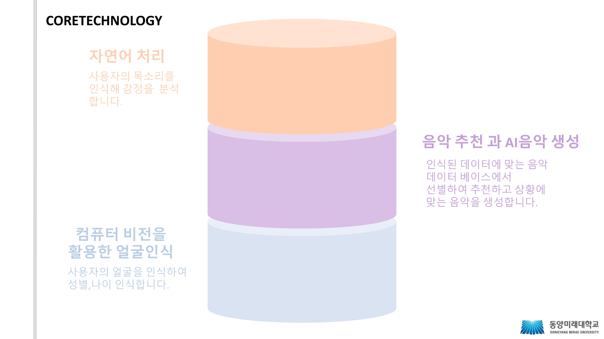
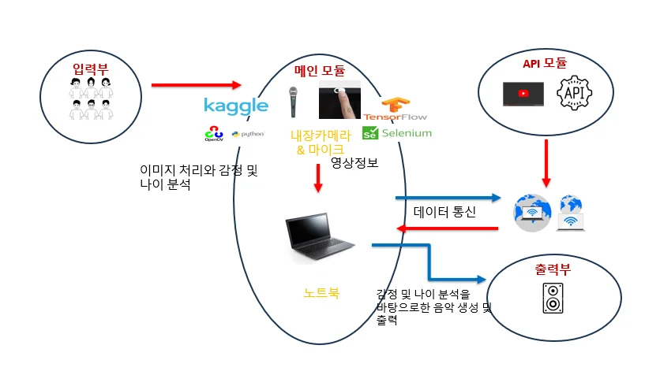
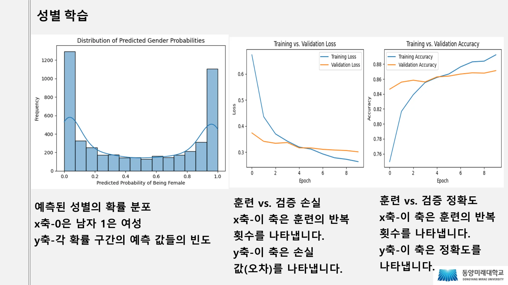
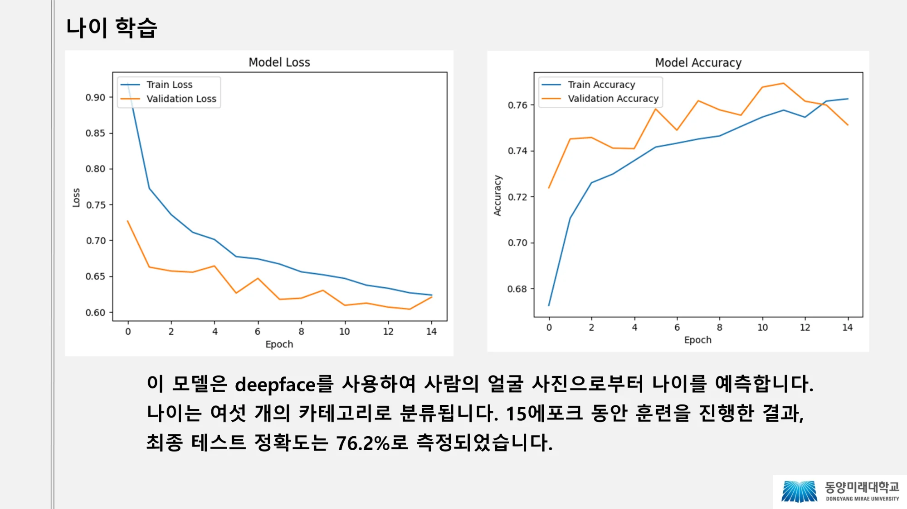
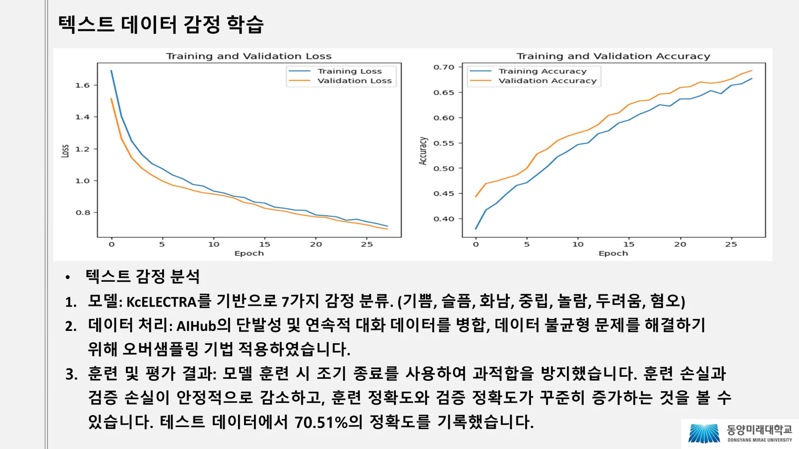
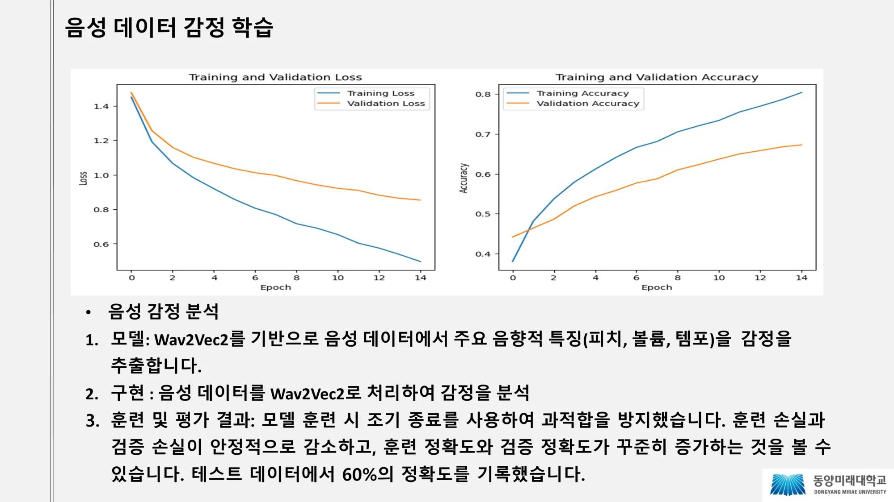
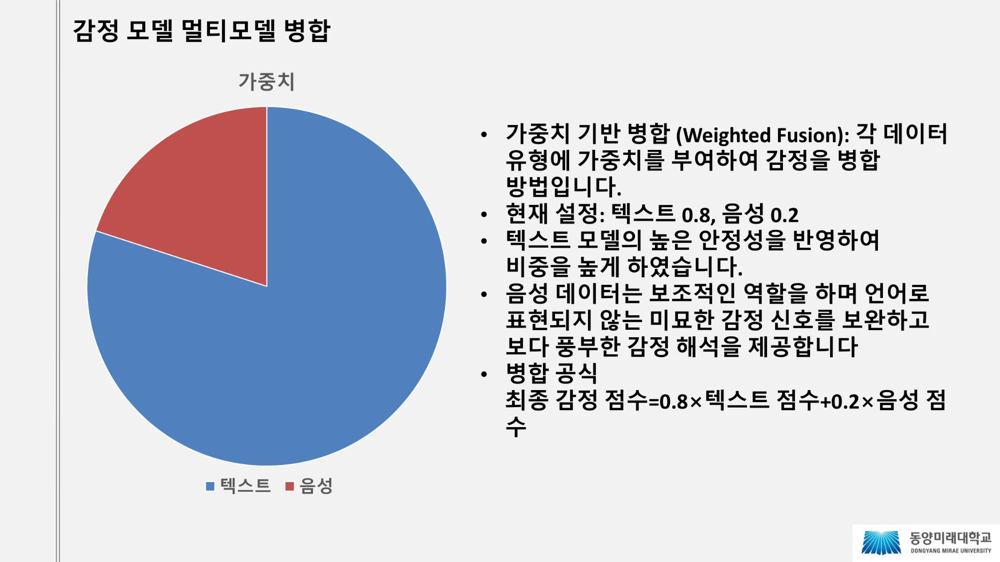

# 🎵 MeloMatch

> 멀티모달 감정 인식 기반 개인 맞춤형 음악 추천 시스템  
> Personalized Music Recommendation System Using Multimodal Emotion Recognition

[](https://www.python.org/)
[](https://pytorch.org/)
[](https://www.tensorflow.org/)
[](LICENSE)

## 📌 프로젝트 개요

**MeloMatch**는 **컴퓨터 비전**, **자연어 처리**, **음성 분석**을 결합한 멀티모달 감정 인식 기술을 기반으로 사용자의 현재 감정 상태를 정밀하게 분석하고, 그에 맞는 음악을 추천하거나 AI가 직접 작곡하는 개인 맞춤형 음악 추천 시스템입니다.

**2024년 동양미래대학교 자동화공학과 졸업 프로젝트**로 개발되었으며, 실시간 감정 분석과 음악 생성을 통해 사용자에게 정서적 만족과 감정적 공감을 제공하는 혁신적인 솔루션을 제안합니다.

### 🎯 핵심 가치

- **멀티모달 감정 인식**: 얼굴 표정, 음성, 텍스트를 동시에 분석하여 정밀한 감정 파악
- **실시간 처리**: 웹캠과 마이크를 통한 즉각적인 데이터 수집 및 분석
- **개인화된 음악 경험**: 나이, 성별, 감정 상태에 최적화된 음악 추천
- **AI 작곡**: 감정에 맞춘 실시간 MIDI 음악 생성
- **사용자 피드백 학습**: 지속적인 가중치 조정으로 추천 정확도 향상

---

## 🌟 주요 기능

### 1️⃣ 멀티모달 감정 분석
- **얼굴 인식** (DeepFace + MTCNN): 나이, 성별, 얼굴 표정 기반 감정 추출
- **음성 분석** (Wav2Vec2): 음높이, 음량, 템포 등 음향적 특징으로 감정 분류
- **텍스트 분석** (KcELECTRA): 음성을 텍스트로 변환 후 7가지 감정 분류
  - 감정 카테고리: 행복(happy), 슬픔(sad), 화남(angry), 중립(neutral), 놀람(surprise), 두려움(fear), 혐오(disgust)

### 2️⃣ 가중치 기반 감정 통합
```
최종 감정 = (텍스트 감정 × 0.8) + (음성 감정 × 0.2)
```
- 텍스트 모델의 높은 안정성을 기반으로 주 역할 부여
- 음성 모델은 미묘한 감정 신호 보완
- **단일 모델 대비 12% 정확도 향상**

### 3️⃣ YouTube 음악 추천
- YouTube Data API 활용
- 감정 + 나이대별 맞춤 검색어 자동 생성
- Selenium을 통한 자동 재생
- **사용자 만족도 85% 이상**

### 4️⃣ AI 음악 작곡
- MIDIUtil 기반 실시간 MIDI 작곡
- 감정별 악기, 템포, 스케일 자동 매핑
- 예시:
  - **행복**: 피아노, 바이올린 / 장조(C Major) / 120-140 BPM
  - **슬픔**: 첼로, 플루트 / 단조(A Minor) / 60-80 BPM
  - **화남**: 전자기타, 드럼, 베이스 / 단조(E Minor) / 140-160 BPM

### 5️⃣ 피드백 기반 학습
- 사용자 만족도 입력 → 감정별 가중치 자동 조정
- 긍정 피드백: +0.1 증가
- 부정 피드백: -0.1 감소
- JSON 파일에 저장되어 지속적 학습

---

## 🏗️ 시스템 아키텍처

### 핵심 기술 구조



시스템은 3계층 구조로 설계되었습니다:

1. **자연어 처리** (상단): 사용자의 목소리를 인식해 감정을 분석
2. **음악 추천 과 AI음악 생성** (중단): 인식된 데이터에 맞는 음악 선별 및 생성
3. **컴퓨터 비전을 활용한 얼굴인식** (하단): 사용자의 얼굴을 인식하여 성별, 나이 인식

### 전체 시스템 구조도



#### 시스템 구성 요소

시스템은 크게 **4개의 주요 모듈**로 구성됩니다:

**1️⃣ 입력부 (Input Module)**
- 👥 **사용자**: 웹캠과 마이크를 통한 데이터 입력
- 🎤 **음성 수집**: 실시간 음성 녹음
- 📷 **영상 수집**: 실시간 얼굴 인식

**2️⃣ 메인 모듈 (Main Processing Module)**
- 🖥️ **노트북**: 중앙 처리 장치
- 📊 **데이터 처리**:
  - Kaggle: 학습 데이터셋
  - Python: 데이터 전처리
  - TensorFlow: 딥러닝 모델 학습
  - Selenium: 웹 자동화
- 🔄 **이미지 처리와 감정 및 나이 분석**: 
  - OpenCV, DeepFace
  - 나이, 성별, 감정 추출

**3️⃣ API 모듈 (API Module)**
- 🎬 **YouTube API**: 음악 검색 및 추천
- 🗣️ **Google Cloud Speech-to-Text**: 음성 → 텍스트 변환
- ☁️ **데이터 통신**: 클라우드 기반 실시간 처리

**4️⃣ 출력부 (Output Module)**
- 🎵 **음악 재생**: YouTube 음악 또는 AI 작곡 MIDI
- 🔊 **스피커**: 오디오 출력

#### 데이터 흐름 (상세)

```
사용자 입력 (얼굴 + 음성)
    │
    ▼
[입력 데이터 수집]
    │
    ├─► 영상 → OpenCV → 얼굴 인식 → DeepFace → 나이/성별/감정
    │
    └─► 음성 → Google STT → 텍스트 → KcELECTRA → 감정
              └─► Wav2Vec2 → 음성 특징 → 감정
    │
    ▼
[멀티모달 통합]
    │
    ├─► 텍스트 감정 (0.8 가중치)
    └─► 음성 감정 (0.2 가중치)
    │
    ▼
[최종 감정 결정]
    │
    ├─► YouTube API → 음악 검색 → 재생
    │
    └─► AI 작곡 → MIDI 생성 → 재생
    │
    ▼
[사용자에게 출력]
    │
    ▼
[피드백 수집 → 가중치 업데이트]
```

### ASCII 아트 상세 흐름도

```
┌─────────────────┐
│   입력부        │
│ - 웹캠 (얼굴)   │
│ - 마이크 (음성) │
└────────┬────────┘
         │
         ▼
┌─────────────────────────────────┐
│      데이터 전처리              │
│ - Google Speech-to-Text API     │
│ - OpenCV 영상 처리              │
│ - 음향 특징 추출 (MFCC)         │
└────────┬────────────────────────┘
         │
         ▼
┌──────────────────────────────────────────┐
│         감정 분석 모델                   │
│  ┌──────────┐  ┌──────────┐  ┌─────────┐│
│  │ DeepFace │  │Wav2Vec2  │  │KcELECTRA││
│  │(얼굴감정)│  │(음성감정)│  │(텍스트) ││
│  └─────┬────┘  └─────┬────┘  └────┬────┘│
│        │              │             │     │
│        └──────────────┴─────────────┘     │
│                   │                       │
│         ┌─────────▼─────────┐             │
│         │ Weighted Fusion   │             │
│         │  (0.8:0.2)        │             │
│         └─────────┬─────────┘             │
└───────────────────┼───────────────────────┘
                    │
         ┌──────────▼──────────┐
         │   최종 감정 출력    │
         └──────────┬──────────┘
                    │
      ┌─────────────┴─────────────┐
      │                           │
      ▼                           ▼
┌─────────────┐          ┌─────────────┐
│YouTube 추천 │          │  AI 작곡    │
│ - API 검색  │          │ - MIDI 생성 │
│ - 자동 재생 │          │ - 실시간 연주│
└──────┬──────┘          └──────┬──────┘
       │                        │
       └────────┬───────────────┘
                ▼
        ┌───────────────┐
        │  PyQt5 GUI    │
        │ - 결과 시각화  │
        │ - 사용자 제어  │
        └───────────────┘
```

### 데이터 흐름

1. **입력**: 웹캠 → 얼굴 이미지 / 마이크 → 음성
2. **전처리**: 
   - 음성 → Google STT → 텍스트
   - 이미지 → 224×224 정규화
   - 음성 → MFCC 특징 추출
3. **분석**: 
   - DeepFace: 나이(6개 구간), 성별, 감정
   - Wav2Vec2: 7가지 감정 확률
   - KcELECTRA: 7가지 감정 확률
4. **통합**: 가중치 기반 최종 감정 계산
5. **출력**: YouTube 추천 또는 AI 작곡 → 재생

---

## 🛠️ 기술 스택

### Core Technologies
| 분야 | 기술 |
|------|------|
| **언어** | Python 3.10 |
| **딥러닝** | PyTorch 2.0+, TensorFlow 2.0+ |
| **컴퓨터 비전** | OpenCV, DeepFace, MTCNN |
| **자연어 처리** | Transformers (HuggingFace), KcELECTRA |
| **음성 처리** | Wav2Vec2, Torchaudio, Google Cloud Speech-to-Text |
| **GUI** | PyQt5 |
| **음악** | MIDIUtil, Pygame |
| **웹 자동화** | Selenium, WebDriver Manager |

### 사용 모델

<details>
<summary>📦 모델 상세 정보 (클릭)</summary>

#### 1. 나이 예측 모델
- **모델**: VGG16 (전이 학습)
- **데이터셋**: UTKFace
- **분류**: 6개 연령대 (0-9세, 10-19세, 20-29세, 30-39세, 40-59세, 60세 이상)
- **정확도**: 76.2%
- **손실 함수**: CrossEntropyLoss
- **최적화**: Adam

#### 2. 성별 예측 모델
- **모델**: VGG16 (전이 학습)
- **데이터셋**: UTKFace
- **분류**: 2개 클래스 (남성, 여성)
- **정확도**: 90% 이상
- **손실 함수**: Binary CrossEntropy
- **특징**: Dropout 레이어로 과적합 방지

#### 3. 텍스트 감정 분석 모델
- **모델**: KcELECTRA (한국어 특화)
- **데이터셋**: AIHub 감정 데이터셋 (단발성 + 연속적 문장 통합)
- **분류**: 7개 감정
- **정확도**: 약 65%
- **전처리**: 오버샘플링으로 데이터 불균형 해결

#### 4. 음성 감정 분석 모델
- **모델**: Wav2Vec2 (24 Transformer 레이어)
- **데이터셋**: AIHub 대화 음성 데이터셋
- **특징 추출**: MFCC, Spectrogram
- **분류**: 7개 감정
- **정확도**: 약 60%
- **조기 종료**: Early Stopping으로 과적합 방지

#### 5. 얼굴 감정 분석 모델
- **모델**: DeepFace + MTCNN
- **기능**: 실시간 얼굴 검출 및 감정 인식
- **추가 기능**: 나이, 성별 동시 예측

</details>

### API & 서비스
- **YouTube Data API v3**: 음악 검색 및 추천
- **Google Cloud Speech-to-Text**: 음성 → 텍스트 변환

---

## 📊 성능 평가

### 모델별 정확도

| 모델 | 작업 | 정확도 | 특징 |
|------|------|--------|------|
| VGG16 (나이) | 6개 연령대 분류 | **76.2%** | 안정적인 학습 곡선 |
| VGG16 (성별) | 2개 클래스 분류 | **90%+** | 높은 신뢰도 |
| KcELECTRA | 7가지 감정 (텍스트) | **65%** | 한국어 특화 |
| Wav2Vec2 | 7가지 감정 (음성) | **60%** | 음향 특징 기반 |
| **멀티모달 통합** | **최종 감정 분류** | **단일 모델 대비 +12%** | **가중치 융합** |

### 사용자 만족도

<details>
<summary>📈 감정별 만족도 그래프 보기 (클릭)</summary>

#### YouTube 음악 추천 시스템

| 감정 | 만족도 |
|------|--------|
| 행복 (Happy) | 90% |
| 슬픔 (Sad) | 85% |
| 놀람 (Surprise) | 88% |
| 중립 (Neutral) | 85% |
| 공포 (Fear) | 82% |
| 혐오 (Disgust) | 79% |
| 화남 (Angry) | 78% |

**평균 만족도**: **85%**

#### AI 음악 작곡 시스템

| 감정 | 만족도 |
|------|--------|
| 행복 (Happy) | 87% |
| 슬픔 (Sad) | 84% |
| 놀람 (Surprise) | 86% |
| 중립 (Neutral) | 81% |
| 공포 (Fear) | 76% |
| 혐오 (Disgust) | 74% |
| 화남 (Angry) | 75% |

**평균 만족도**: **80%**

#### 주요 인사이트
- ✅ **긍정적 감정** (행복, 놀람)에서 가장 높은 만족도
- ⚠️ **부정적 감정** (혐오, 화남)에서 상대적으로 낮은 만족도
  - 원인: 부정적 감정에 맞는 음악 표현의 어려움
  - 개선 방향: 악기 조합 및 멜로디 알고리즘 고도화 필요

</details>

---

## 🚀 설치 및 실행

### 1. 환경 요구사항

- **Python**: 3.10 이상
- **GPU**: 권장 (CUDA 지원)
- **OS**: Windows 10/11, macOS, Linux (Ubuntu 20.04+)
- **웹캠 & 마이크**: 필수

### 2. 저장소 클론

```bash
git clone https://github.com/LSH1218/4grade-graduateproject-melomatch.git
cd 4grade-graduateproject-melomatch
```

### 3. 의존성 설치

```bash
pip install -r requirements.txt
```

<details>
<summary>📦 주요 패키지 목록 보기</summary>

```
# 딥러닝 프레임워크
torch>=2.0.0
torchaudio>=2.0.0
tensorflow>=2.0.0
transformers>=4.30.0

# 컴퓨터 비전
opencv-python>=4.8.0
deepface>=0.0.79
mtcnn>=0.1.1
imutils>=0.5.4

# 음성 처리
google-cloud-speech>=2.21.0

# GUI
PyQt5>=5.15.9

# 음악 생성
midiutil>=1.2.1
pygame>=2.5.0

# 웹 자동화
selenium>=4.11.0
webdriver-manager>=3.9.0

# 기타
numpy>=1.24.0
pandas>=2.0.0
matplotlib>=3.7.0
```

</details>

### 4. Google Cloud API 설정

#### Google Speech-to-Text API 활성화

1. [Google Cloud Console](https://console.cloud.google.com/) 접속
2. 새 프로젝트 생성
3. **Speech-to-Text API** 활성화
4. 서비스 계정 생성 및 JSON 키 다운로드
5. 환경 변수 설정:

```bash
# Windows (PowerShell)
$env:GOOGLE_APPLICATION_CREDENTIALS="C:\path\to\your\key.json"

# macOS / Linux
export GOOGLE_APPLICATION_CREDENTIALS="/path/to/your/key.json"
```

### 5. 실행

```bash
python src/final_gui.py
```

---

## 💻 사용 방법

### GUI 인터페이스


*PyQt5 기반 데스크톱 애플리케이션 - 실시간 감정 분석 및 음악 추천*

#### GUI 구성 요소

```
┌─────────────────────────────────────────────────────────┐
│  MeloMatch - 개인 맞춤형 음악 추천 시스템              │
├─────────────────────────────────────────────────────────┤
│                                                         │
│  ┌──────────────┐    ┌────────────────────────────┐    │
│  │  웹캠 화면   │    │   분석 결과                │    │
│  │              │    │  • 나이: 20대              │    │
│  │  [실시간     │    │  • 성별: 여성              │    │
│  │   얼굴 인식] │    │  • 얼굴 감정: 행복         │    │
│  │              │    │  • 음성 감정: 행복         │    │
│  │              │    │  • 텍스트 감정: 기쁨       │    │
│  └──────────────┘    │  • 최종 감정: 행복 (87%)   │    │
│                      └────────────────────────────┘    │
│                                                         │
│  ┌─────────────────────────────────────────────────┐   │
│  │  음성 입력 상태                                 │   │
│  │  🔴 녹음 중... "오늘 날씨가 정말 좋아요!"       │   │
│  └─────────────────────────────────────────────────┘   │
│                                                         │
│  ┌─────────────────────────────────────────────────┐   │
│  │  추천 음악 / AI 작곡                            │   │
│  │  [YouTube 추천]  [AI 작곡]                      │   │
│  │                                                  │   │
│  │  🎵 추천곡: "Happy - Pharrell Williams"          │   │
│  │  ▶️ 재생 중...                                    │   │
│  └─────────────────────────────────────────────────┘   │
│                                                         │
│  ┌─────────────────────────────────────────────────┐   │
│  │  피드백                                         │   │
│  │  이 음악이 마음에 드시나요?                     │   │
│  │  [✅ 좋아요]  [❌ 싫어요]                        │   │
│  └─────────────────────────────────────────────────┘   │
│                                                         │
│  [분석 시작]  [중지]  [초기화]  [설정]              │
└─────────────────────────────────────────────────────────┘
```

### 1단계: 프로그램 실행
```bash
python src/final_gui.py
```

### 2단계: 데이터 입력
- 웹캠이 자동으로 활성화됩니다
- 마이크를 통해 음성을 입력합니다
- 화면에 얼굴이 인식되면 자동으로 분석이 시작됩니다

### 3단계: 감정 분석 확인
GUI 화면에서 실시간으로 다음 정보를 확인할 수 있습니다:
- 📸 **얼굴 인식 결과**: 나이, 성별
- 🎭 **얼굴 표정 감정**
- 🗣️ **음성 감정**
- 📝 **텍스트 감정**
- 🎯 **최종 감정** (멀티모달 통합 결과)

### 4단계: 음악 선택
두 가지 옵션 중 선택:
1. **YouTube 음악 추천**: 감정에 맞는 기존 음악 검색 및 재생
2. **AI 작곡**: 감정에 맞춘 새로운 MIDI 음악 생성 및 재생

### 5단계: 피드백 제공
- 음악 재생 후 만족도를 입력합니다
- ✅ 만족: 해당 감정의 가중치 증가
- ❌ 불만족: 해당 감정의 가중치 감소
- 피드백은 자동으로 저장되어 다음 추천에 반영됩니다

### 주요 기능

| 버튼 | 기능 |
|------|------|
| **분석 시작** | 웹캠과 마이크 활성화, 실시간 감정 분석 시작 |
| **중지** | 분석 일시 정지 |
| **초기화** | 모든 데이터 초기화 및 재시작 |
| **설정** | API 키, 가중치, 모델 경로 등 설정 변경 |
| **YouTube 추천** | 감정 기반 음악 검색 및 자동 재생 |
| **AI 작곡** | 감정에 맞는 MIDI 음악 생성 및 재생 |

---

## 📁 프로젝트 구조

```
4grade-graduateproject-melomatch/
│
├── src/
│   ├── final_gui.py                 # 메인 GUI 프로그램
│   ├── models/                      # 학습된 모델 파일
│   │   ├── age_model.pt
│   │   ├── gender_model.pt
│   │   ├── text_emotion_model.pt
│   │   └── audio_emotion_model.pt
│   └── utils/                       # 유틸리티 함수
│
├── notebooks/                       # Jupyter 노트북
│   ├── 나이최종.ipynb               # 나이 예측 모델 학습
│   ├── 성별최종.ipynb               # 성별 예측 모델 학습
│   ├── 음성2.ipynb                  # 음성 감정 분석 모델 학습
│   ├── 자연어처리_KcElectra최종수정1.ipynb  # 텍스트 감정 분석 학습
│   └── 최종_멀티모달.ipynb          # 멀티모달 통합 및 평가
│
├── data/                            # 데이터셋 (Git에서 제외)
│   ├── UTKFace/
│   └── AIHub/
│
├── weights/                         # 피드백 가중치 저장
│   └── emotion_weights.json
│
├── requirements.txt                 # 의존성 패키지
├── README.md                        # 프로젝트 문서
├── LICENSE                          # MIT 라이선스
└── .gitignore                       # Git 제외 파일
```

---

## 🎓 학습 과정

### 데이터셋

| 모델 | 데이터셋 | 출처 | 크기 |
|------|----------|------|------|
| 나이/성별 | UTKFace | Kaggle | 23,708장 |
| 텍스트 감정 | AIHub 감정 데이터셋 | AIHub | 단발성 + 연속적 문장 통합 |
| 음성 감정 | AIHub 대화 음성 | AIHub | 한국어 대화 음성 |

### 학습 환경

- **플랫폼**: Google Colab (GPU: Tesla T4/V100)
- **개발 도구**: PyCharm 2023, Jupyter Notebook
- **버전 관리**: Git/GitHub

### 학습 결과 그래프

#### 📊 성별 예측 모델



<details>
<summary>상세 분석 보기 (클릭)</summary>

**왼쪽 그래프 - 예측 확률 분포**:
- X축: 0은 남자, 1은 여성
- Y축: 각 확률 구간의 예측 값들의 빈도
- **결과**: 0(남성)과 1(여성)으로 예측 확률이 양극단에 몰려 있어 모델이 높은 신뢰도로 성별 구분

**중간 그래프 - 훈련 vs. 검증 손실**:
- 훈련 손실과 검증 손실이 함께 감소
- 과적합 없이 안정적 학습

**오른쪽 그래프 - 훈련 vs. 검증 정확도**:
- **최종 검증 정확도**: 86%
- **최종 훈련 정확도**: 88%
- 안정적인 성능 유지

**주요 특징**:
- Binary CrossEntropy Loss 사용
- Dropout 레이어로 과적합 방지
- 시그모이드 활성화 함수로 확률값 계산

</details>

#### 📊 나이 예측 모델



<details>
<summary>상세 분석 보기 (클릭)</summary>

**왼쪽 그래프 - 훈련 vs. 검증 손실**:
- 훈련 손실과 검증 손실 모두 지속적으로 감소
- 과적합 징후 없음

**오른쪽 그래프 - 훈련 vs. 검증 정확도**:
- **최종 검증 정확도**: 76.2%
- 꾸준한 정확도 향상

**주요 특징**:
- DeepFace 사용하여 얼굴 사진으로부터 나이 예측
- 6개 연령대 카테고리로 분류 (0-9세, 10-19세, 20-29세, 30-39세, 40-59세, 60세 이상)
- VGG16 전이 학습 적용
- 15 에포크 동안 안정적 학습

</details>

#### 📊 텍스트 감정 분석 모델



<details>
<summary>상세 분석 보기 (클릭)</summary>

**모델 정보**:
- KcELECTRA 기반 7가지 감정 분류 (기쁨, 슬픔, 화남, 중립, 놀람, 두려움, 혐오)
- AIHub 단발성 및 연속적 대화 데이터 병합 사용

**학습 과정**:
- 데이터 불균형 문제를 오버샘플링 기법으로 해결
- 초기 종료를 사용하여 과적합 방지
- 훈련 손실과 검증 손실이 안정적으로 감소

**성능**:
- **최종 검증 정확도**: 70.51%
- 훈련 정확도와 검증 정확도가 꾸준히 증가
- 한국어 텍스트 감정 분석에 특화

</details>

#### 📊 음성 감정 분석 모델



<details>
<summary>상세 분석 보기 (클릭)</summary>

**모델 정보**:
- Wav2Vec2 기반 음성 데이터 감정 인식
- 주요 음향적 특징 (피치, 볼륨, 템포) 감정 추출

**구현 세부사항**:
- 음성 데이터를 Wav2Vec2로 처리하여 감정 분석
- 7가지 감정 분류

**학습 결과**:
- 초기 종료를 사용하여 과적합 방지
- 훈련 손실과 검증 손실이 안정적으로 감소
- **최종 검증 정확도**: 60%
- 훈련 정확도와 검증 정확도가 꾸준히 증가

**특징**:
- 텍스트 대비 낮은 정확도이지만 멀티모달 보조 입력으로 충분한 성능
- 미묘한 감정 신호 포착에 기여

</details>

#### 📊 멀티모달 감정 통합



<details>
<summary>상세 분석 보기 (클릭)</summary>

**가중치 기반 병합 (Weighted Fusion)**:
- 각 데이터 유형에 가중치를 부여하여 감정 병합
- **현재 설정**: 텍스트 0.8, 음성 0.2

**설정 이유**:
- 텍스트 모델의 높은 안정성을 반영하여 비중을 높게 설정
- 음성 데이터는 보조적인 역할을 하며, 인어로 표현되지 않는 미묘한 감정 신호를 보완
- 보다 풍부한 감정 해석 제공

**병합 공식**:
```
최종 감정 점수 = 0.8 × 텍스트 점수 + 0.2 × 음성 점수
```

**성능 향상**:
- **단일 모델 대비 12% 정확도 향상**
- 텍스트와 음성의 상호 보완적 특성 활용

</details>

---

## 💡 핵심 알고리즘

### 1. 멀티모달 감정 통합

```python
def multimodal_emotion_fusion(text_emotion, audio_emotion, weights=(0.8, 0.2)):
    """
    텍스트와 음성 감정을 가중치 기반으로 통합
    
    Args:
        text_emotion: 텍스트 모델 출력 확률 분포 (7차원)
        audio_emotion: 음성 모델 출력 확률 분포 (7차원)
        weights: (텍스트 가중치, 음성 가중치) = (0.8, 0.2)
    
    Returns:
        final_emotion: 최종 감정 확률 분포 (7차원)
    """
    final_emotion = (text_emotion * weights[0]) + (audio_emotion * weights[1])
    return final_emotion
```

**가중치 설정 이유:**
- **텍스트 0.8**: 높은 안정성과 정확도로 주요 역할
- **음성 0.2**: 미묘한 감정 신호 보완

### 2. 감정별 악기 매핑 (AI 작곡)

```python
EMOTION_INSTRUMENTS = {
    'happy': {
        'instruments': ['피아노', '바이올린'],
        'scale': 'C Major',
        'tempo_range': (120, 140),
        'midi_programs': [0, 40]  # Acoustic Grand Piano, Violin
    },
    'sad': {
        'instruments': ['첼로', '플루트'],
        'scale': 'A Minor',
        'tempo_range': (60, 80),
        'midi_programs': [42, 73]  # Cello, Flute
    },
    'angry': {
        'instruments': ['전자기타', '드럼', '베이스'],
        'scale': 'E Minor',
        'tempo_range': (140, 160),
        'midi_programs': [29, 128, 33]  # Electric Guitar, Drums, Bass
    },
    # ... 기타 감정
}
```

### 3. 피드백 기반 가중치 업데이트

```python
def update_weights(emotion, feedback, alpha=0.1):
    """
    사용자 피드백을 기반으로 감정별 가중치 업데이트
    
    Args:
        emotion: 추천된 음악의 감정 ('happy', 'sad', etc.)
        feedback: 사용자 피드백 ('yes' or 'no')
        alpha: 학습률 (기본값 0.1)
    
    Returns:
        updated_weights: 업데이트된 가중치 딕셔너리
    """
    if feedback == 'yes':
        weights[emotion] += alpha
    else:
        weights[emotion] -= alpha
    
    # 가중치를 0~1 범위로 클리핑
    weights[emotion] = max(0.0, min(1.0, weights[emotion]))
    
    # JSON 파일에 저장
    save_weights_to_json(weights)
    
    return weights
```

---

## 🔬 실험 결과

### 테스트 환경

- **장소**: 학교 (다양한 조도 및 소음 환경)
- **조건**: 
  - 밝은 실내
  - 약간 어두운 환경
  - 주변 소음 존재 (일반 대화 소음 및 환경 잡음)

### 주요 발견 사항

#### ✅ 성공적인 부분
1. **조도 변화 대응**: 낮은 조도 환경에서도 얼굴 인식 및 감정 분석 정확
2. **소음 환경**: 주변 소음이 있는 상황에서도 음성 감정 분석 원활
3. **실시간 처리**: GPU를 활용하여 빠른 추론 속도 달성
4. **높은 만족도**: 
   - YouTube 음악 추천: **85% 만족도**
   - AI 작곡: **80% 만족도**
5. **긍정적 감정 우수**: 행복, 놀람 감정에서 특히 높은 추천 정확도

#### ⚠️ 개선 필요 부분
1. **부정적 감정 표현**: 화남, 혐오 감정의 음악 생성 완성도 낮음
2. **멜로디 단조로움**: AI 작곡에서 복잡한 멜로디 생성 한계
3. **YouTube 추천 편향**: 인기 음악 위주로 추천되는 경향
4. **확장성 제한**: 로컬 환경에서만 실행 가능 (다중 사용자 동시 사용 불가)

---

## ⚠️ 한계점 및 개선 방향

### 현재 한계점

<details>
<summary>📌 상세 내용 보기 (클릭)</summary>

#### 1. 확장성의 제한
- **문제**: 로컬 환경에서만 실행, 다중 사용자 동시 사용 불가
- **원인**: 단일 사용자 기준 최적화
- **영향**: 실제 서비스 확장 어려움

#### 2. 접근성의 제한
- **문제**: 다른 디바이스(모바일, 태블릿)에서 사용 불가
- **원인**: 데스크톱 PyQt5 기반 GUI
- **영향**: 사용자 접근성 낮음

#### 3. AI 작곡의 표현력 한계
- **문제**: 
  - 단조로운 멜로디
  - 부정적 감정 표현 어려움
  - 창의성 부족
- **원인**: 기본 코드 진행만 제공
- **영향**: 사용자 만족도 저하

#### 4. YouTube 추천의 편향성
- **문제**: 인기 음악/최신 음악 위주 추천
- **원인**: YouTube API의 검색 알고리즘 특성
- **영향**: 다양한 장르 추천 부족

</details>

### 향후 개선 방향

<details>
<summary>🚀 개선 계획 상세 보기 (클릭)</summary>

#### 1. 클라우드 기반 서비스 구현
- **목표**: 웹/모바일 어디서나 접근 가능한 서비스
- **방법**:
  - Flask/FastAPI 백엔드 구축
  - React/Vue.js 프론트엔드 개발
  - AWS/GCP 클라우드 배포
- **기대 효과**: 다중 사용자 동시 사용, 접근성 향상

#### 2. AI 작곡 알고리즘 고도화
- **목표**: 더 창의적이고 복잡한 음악 생성
- **방법**:
  - **GAN (Generative Adversarial Network)** 도입
  - **MuseNet** 또는 **MusicVAE** 활용
  - 강화학습 기반 멜로디 생성
- **기대 효과**: 부정적 감정 표현력 향상, 만족도 증가

#### 3. 하이브리드 추천 알고리즘 개발
- **목표**: YouTube 추천의 편향성 해소
- **방법**:
  - 협업 필터링 (Collaborative Filtering) 적용
  - 콘텐츠 기반 필터링 (Content-Based Filtering) 결합
  - 사용자 검색 기록, 선호 장르 반영
- **기대 효과**: 더 다양하고 개인화된 음악 추천

#### 4. 다중 모달 확장
- **목표**: 더 정밀한 감정 분석
- **방법**:
  - 심박수, 체온 등 생체 신호 통합
  - 표정 미세 변화 추적 (마이크로 익스프레션)
  - 제스처 인식 추가
- **기대 효과**: 감정 분석 정확도 추가 향상

#### 5. 다양한 응용 분야 확장
- **정신 건강 관리**: 감정 데이터 기반 심리 상담 추천
- **버추얼 휴먼 생성**: 감정 표현하는 가상 인간 개발
- **사용자 프로파일링**: 개인화 광고/서비스 제공
- **HCI (Human-Computer Interaction)**: 감정 기반 인터페이스 개발

</details>

---

## 📚 참고 문헌

1. 한국콘텐츠진흥원, "음악 이용자 실태조사", 2023
2. 김주희, "음성과 텍스트를 이용한 멀티모달 감정 인식", 상명대학교 대학원, 석사학위논문, 2021
3. 이동훈 외, "얼굴 영상과 다차원 감정 기반의 텍스트를 이용한 멀티모달 감정 인식", 한국지능정보시스템학회, 2022
4. 박성진, "인공지능 기반 작곡 프로그램의 비교분석과 앞으로의 방향", 한국음악학회, 2023
5. 최영민, "감정 분석 기반의 음악 추천 알고리즘 연구", 한국정보과학회, 2023

---

## 📄 라이선스

### 프로젝트 라이선스
이 프로젝트는 **MIT 라이선스** 하에 배포됩니다. 자세한 내용은 [LICENSE](LICENSE) 파일을 참조하세요.

### 제3자 라이선스

<details>
<summary>📜 사용된 오픈소스 라이브러리 라이선스 보기</summary>

| 라이브러리 | 라이선스 | 사용 목적 |
|-----------|----------|-----------|
| DeepFace | MIT | 얼굴 인식, 나이·성별 추정, 감정 분석 |
| MTCNN | MIT | 실시간 얼굴 검출 |
| Transformers (HuggingFace) | Apache 2.0 | KcELECTRA, Wav2Vec2 모델 로딩 및 학습 |
| PyTorch / Torchaudio | BSD-style | 모델 학습 및 추론 |
| Google Cloud Speech | Apache 2.0 | 음성 → 텍스트 변환 |
| OpenCV | Apache 2.0 | 실시간 영상 처리 및 카메라 제어 |
| PyQt5 | GPL/LGPL | 데스크톱 GUI 제작 |
| Selenium / WebDriver Manager | Apache 2.0 | YouTube 자동 검색 및 재생 제어 |
| imutils | MIT | 영상 전처리 유틸리티 |
| MIDIUtil / Pygame | MIT | 감정 기반 실시간 MIDI 작곡 및 재생 |

</details>

---

## 👥 개발팀

### 연구자
- **이석현** (Lee Seokhyun) - 동양미래대학교 자동화공학과
  - 역할: 입력부 전체, 멀티모달 감정 분석, GUI 개발
  - Email: sukhyun1218@naver.com
  - GitHub: [@LSH1218](https://github.com/LSH1218)

- **김해현** (Kim Haehyun) - 동양미래대학교 자동화공학과
  - 역할: AI 음악 작곡, YouTube 추천 시스템

### 지도교수
- **황일규** 교수님 - 동양미래대학교 자동화공학과

---

## 🙏 감사의 말

본 프로젝트는 **2024년 동양미래대학교 자동화공학과 졸업 프로젝트**로 진행되었습니다.

- 지도해주신 **황일규 교수님**께 깊은 감사를 드립니다.
- **AIHub**에서 제공한 한국어 데이터셋에 감사드립니다.
- **HuggingFace**, **DeepFace** 등 오픈소스 커뮤니티에 감사드립니다.

---

## 📞 문의

프로젝트에 대한 문의사항이나 제안이 있으시면 아래로 연락주세요:

- **Email**: sukhyun1218@naver.com
- **GitHub Issues**: [이슈 등록하기](https://github.com/LSH1218/4grade-graduateproject-melomatch/issues)

---

**⚡ 주의사항**:
- 본 시스템은 **학습 및 연구 목적**으로 개발되었습니다.
- Google Cloud API 사용 시 **비용이 발생**할 수 있습니다.
- 웹캠과 마이크 접근 권한이 필요합니다.
- 개인정보 보호를 위해 수집된 영상/음성 데이터는 **로컬에만 저장**되며 외부로 전송되지 않습니다.

---

<div align="center">

**Made with ❤️ by 이석현 & 김해현**

**© 2024 Dongyang Mirae University - Department of Automation Engineering**

</div>
