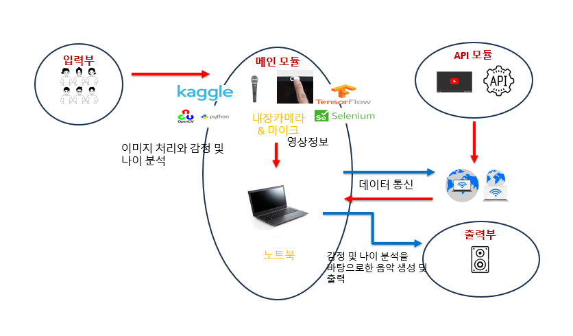
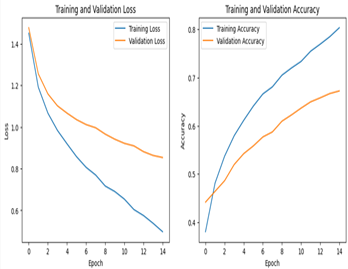

# 4grade-graduateproject-melomatch

📜 Third-Party Licenses

이 프로젝트는 다음과 같은 오픈소스 라이브러리를 사용하며 각 라이브러리는 고유의 라이선스를 따른다.
| Library                          | License            | 사용 목적                                     |
| -------------------------------- | ------------------ | ----------------------------------------- |
| **DeepFace**                     | MIT                | 얼굴 인식·나이·성별 추정 및 감정 분석                    |
| **MTCNN**                        | MIT                | 실시간 얼굴 검출(DeepFace 백엔드)                   |
| **transformers (HuggingFace)**   | Apache License 2.0 | KcELECTRA, Wav2Vec2 모델 로딩 및 파인튜닝          |
| **PyTorch / Torchaudio**         | BSD-style          | 모델 학습 및 추론                                |
| **google-cloud-speech**          | Apache License 2.0 | Google Speech-to-Text API를 통한 음성 → 텍스트 변환 |
| **OpenCV**                       | Apache License 2.0 | 실시간 영상 처리 및 카메라 제어                        |
| **PyQt5**                        | GPL/LGPL           | 데스크톱 GUI 제작                               |
| **selenium / webdriver-manager** | Apache License 2.0 | 유튜브 자동 검색 및 음악 재생 제어                      |
| **imutils**                      | MIT                | 영상 전처리 유틸리티                               |
| **midiutil / pygame**            | MIT                | 감정 기반 실시간 MIDI 작곡 및 재생                    |

프로젝트 설명

Melomatch는 카메라와 마이크를 통해 수집된 영상·음성 데이터를 동시에 분석하여 사용자의 현재 감정 상태를 추론하고 
그 결과에 따라 유튜브 음악을 추천하거나 AI가 직접 작곡한 음악을 실시간으로 재생하는 멀티모달 감정 인식 기반 음악 추천 시스템이다.

🔎 동작 개요

데이터 입력 : 웹캠과 마이크로부터 실시간 영상과 음성을 수집

텍스트 변환 : Google Speech-to-Text API로 음성을 텍스트로 변환

감정 분석

DeepFace + MTCNN : 얼굴 이미지에서 성별·나이·표정 감정 추출

Wav2Vec2 : 음성의 높이·세기 등 음향적 특징으로 감정 분류

KcELECTRA : 텍스트 기반 7가지 감정(angry, happy, sad, neutral, surprise, fear, disgust) 분류

멀티모달 결합 : 텍스트 0.8 + 음성 0.2 가중치로 최종 감정 산출

음악 생성/추천

감정 결과가 안정적이면 유튜브 API + Selenium을 통해 관련 음악 자동 검색·재생

사용자가 AI 작곡 모드를 선택하면 MIDIUtil로 템포·스케일·악기 조합을 결정하고 Pygame으로 실시간 연주

GUI 시현 : PyQt5로 제작한 데스크톱 프로그램에서 카메라 영상, 분석 결과, 추천 음악 제어 버튼 등을 실시간 표시

📊 모델 학습

텍스트 감정 모델(KcELECTRA) : AI Hub 한국어 대화 음성 텍스트 → 7감정 분류

음성 감정 모델(Wav2Vec2) : AI Hub 한국어 대화 음성의 스펙트로그램·음향 특징을 입력으로 학습

얼굴 감정/성별/나이 모델 : UTKFace 등 공개 데이터셋 활용

학습 후 pt 모델을 src/models/ 폴더에 저장하고 final_gui.py가 로드하여 실시간 추론을 수행

⚙️ 개발 환경

개발 도구 : PyCharm 2023 / Google Colab (학습)

실행 환경 : Python 3.10, GPU 학습 지원(Colab)

GUI 실행 : pip install -r requirements.txt
python src/final_gui.py

## 🔎 System Architecture

카메라와 마이크를 통해 입력된 실시간 영상·음성을 Google Speech-to-Text API로
텍스트로 변환하고 DeepFace(얼굴), Wav2Vec2(음성), KcELECTRA(텍스트)가 각각 감정을 분석한다.
세 결과는 Weighted Fusion 모듈에서 가중치(텍스트 0.8, 음성 0.2)로 통합되어 최종 감정을 산출한다.
결과는 PyQt5 GUI를 통해 시각화되며 감정에 따라 유튜브 음악을 추천하거나
AI 작곡 모듈로 전달되어 즉석에서 MIDI 음악을 생성한다.

---

## 🎶 AI Composition Flow

사용자가 카메라와 마이크를 통해 정보를 입력하면 시스템이 감정을 분석하고
해당 감정에 맞는 음악 추천 또는 AI 작곡 경로를 선택한다.
YouTube API를 이용해 감정 키워드 기반 음악을 검색·재생하거나
감정별 템포·스케일·악기를 매핑해 MIDI 파일을 생성해 실시간으로 재생한다.

---

## ⚖️ Weighted Fusion

텍스트와 음성 모델에서 출력된 감정 확률을 통합하기 위해
텍스트 0.8, 음성 0.2의 가중치를 적용하였다.
텍스트 데이터가 비교적 안정적이고 정확도가 높아 높은 비중을 부여했고
음성 데이터는 미묘한 감정 신호를 보완하는 역할을 한다.

---

## 📊 Training Results

### Text Emotion

KcELECTRA 모델을 사용한 한국어 7감정 분류(Text Emotion) 학습 결과.
훈련 초기에는 빠른 정확도 상승을 보였으며 최종 검증 정확도는 약 70% 수준을 기록했다.

### Voice Emotion

AI Hub 대화 음성 데이터로 학습한 Wav2Vec2 기반 음성 감정 분류 결과.
훈련·검증 손실이 안정적으로 감소했으며 최종 검증 정확도는 약 60% 수준으로
텍스트 대비 낮지만 멀티모달 보조 입력으로 활용하기에 충분한 성능을 확보했다.

### Age Classification

UTKFace 데이터셋을 활용한 얼굴 나이 분류 결과.
훈련과 검증 모두 손실이 꾸준히 감소하며 최종 검증 정확도는 약 76%를 달성했다.

### Gender Classification

DeepFace를 활용한 얼굴 성별 분류 결과.
훈련·검증 정확도가 모두 90% 이상으로 안정적인 성능을 보였으며
GUI 실행 시 실시간 성별 예측에 사용된다.
